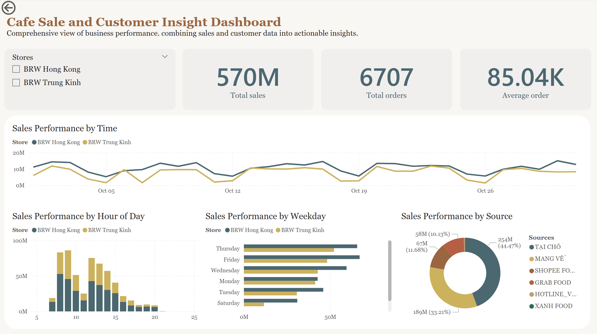

# Café Sales & Customer Insights Dashboard

## Description
A Power BI project focused on improving operational efficiency and loyalty-program visibility. The dashboard analyzes sales and membership data to measure store performance by hour and weekday, and to quantify how each membership tier contributes to daily revenue. It’s designed to help managers make data-driven decisions about staffing, promotions, and loyalty strategies.

## Business problem
Current reporting tools do not measure store efficiency across specific time windows (hour of day, weekday, month) and cannot show the contribution of membership tiers to daily sales. Without this insight, managers cannot reliably optimize staff schedules, time-limited promotions, or evaluate the effectiveness of the loyalty program.

## Methodology
- Data sources: real café data, including sales transactions, customer membership records, products, and store details (CSV/JSON exports).
- Data preparation: cleaned and standardized timestamps, derived time dimensions (HourOfDay, Weekday, Month), and categorized membership tiers using Power Query in Power BI.
- Modeling: created relationships between fact (Sales) and dimension tables (Customers, Stores, Sources).
- DAX measures: calculated Total Sales, Total Orders, Average Order Value, and Sales by Membership Tier.
- Visuals: interactive reports showing hourly and daily efficiency, membership-tier contributions, and store-level breakdowns.
- Outcome: improved visibility into peak sales periods and customer-tier performance, enabling better scheduling and targeted marketing campaigns.

## Tools Used
Power BI · Power Query · DAX · Excel / CSV

## Key Metrics
Total Sales · Total Orders · Average Order Value (AOV) · Sales by Membership Tier

## Visuals
Sales by Time & Store · Source & Store · Weekday & Hour · Membership Funnel · Voucher Usage

## Skills
Data Cleaning · Data Modeling · DAX Calculation · Visualization · Business Analysis

## Results $ Business recomendations

The dashboard revealed several actionable insights:
- Peak Efficiency Periods: Sales are highest between 9 AM – 10 AM and 2 PM – 3 PM, suggesting staffing schedules could be optimized around these hours.
- Membership Contribution: Members contribute around 50% of daily revenue, highlighting the importance of loyalty program engagement.
- Sales Channels: Online orders account for 35% of total revenue, indicating opportunities to increase digital promotions.
- Low-Performing Time Slots: Early morning and late evening hours show low sales, providing opportunities for targeted promotions or menu adjustments.
Recommendations:
- Adjust staffing levels to match peak sales hours to improve efficiency.
- Launch targeted promotions to increase engagement from members and boost overall loyalty program performance.
- Explore marketing campaigns for low-sales periods to increase revenue during off-peak hours.
- Monitor sales channel performance regularly to optimize online and in-store promotions.

## Next Steps
1. Add more KPIs if possible:
- Revenue per product category
- Repeat customer ratio
- Average order per membership tier per day/week
2. Include dynamic filters: by store, sales channel, membership tier, or date range.
3. Improve visual storytelling: use consistent color schemes, clear labels, and tooltips for deeper insights.

